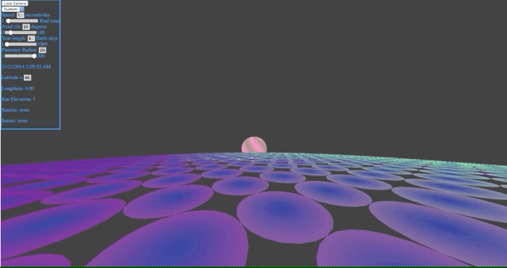
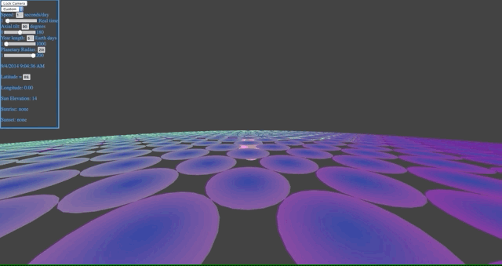

Planetary-Surface-Visualizer
============================

This WebGL application simulates the motion of the sun over the course of the year, complete with a 3D graphical representation of the view from the surface. You can also adjust parameters like the axial tilt or the planetary radius to see how the yearly cycle would look on other planets. 

On Earth, standing on the North Pole over the course of a year, you'd see something like this. The sun disappears below the horizon for half the year, and stays over the horizon for the rest, climbing to a max altitude of ~23 degrees:

With a 90-degree axial tilt, it'd look more like this. Like on Earth, the sun is below the horizon for half the year and above it for the rest. But nearing the summer solstice, it rises to the zenith of the celestial sphere, shining like the noon sun in the tropics on Earth:

Hosted [here](http://lolney.github.io/Planetary-Surface-Visualizer/).
Controls:
W/A/S/D : 		Movement
Left/right arrow keys: 	Rotate left/right
Q/W: 			Rotate side-to-side
Z/X: 			Rotate up-down
